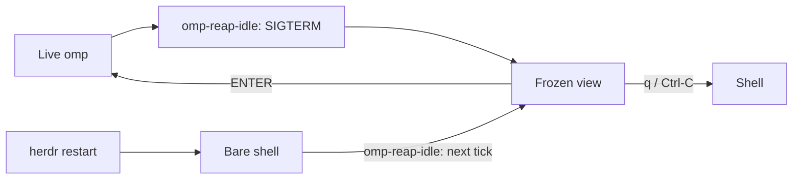

# herdr-omp-sleep

A live `omp` coding-agent session running in a herdr pane holds roughly 400 MB of RSS. Open a dozen panes across a few projects and the machine is out of memory — but closing them loses your place in every conversation. herdr-omp-sleep parks an *idle* session instead: once a pane has been quiet long enough, the omp process is stopped, the pane keeps living as a frozen, scrollable view of the whole conversation, and pressing ENTER brings the session back exactly where it was. Quitting omp yourself still just quits — sleep is something the idle reaper does to you, never something your own Ctrl-C triggers. A sleeping pane measures about 4 MB — 1.8 MB for `less`, 2.2 MB for the wrapper watching it — instead of ~400 MB for a live one; on the development machine, six sleeping panes together used 9.9 MB.

## What you get

- Idle panes sleep after N minutes (default 15), ENTER wakes them back into the same session, and q/Ctrl-C leaves a sleeping pane at its shell.
- The frozen view is not a screenshot and not a description: the whole conversation is re-rendered by **omp's own transcript components**, in **your** theme and settings — the same `initTheme(symbolPreset, colorBlindMode, theme.dark, theme.light)` call `omp gallery` makes, so real colours, message bubbles, tool-call cards and usage footers. It ends where the conversation ends, which is the screen you left.
- Tool output starts **folded**, exactly as omp shows it, and `o` unfolds every result in full while `O` folds back — `less` holds both renders, so switching keeps your place in each. Both open at the end of the conversation.
- Rendered at the pane's **real** width, re-derived on every open, with `r` to re-render after a resize. Measured: a 35 MB session → 31,656 folded rows / 1,305 tool-call cards in 2.5 s per view.
- `omp-hist`, or `/full-hist` inside omp, opens that same render for a **live** session at any time, with the same keys, in a split pane. Compaction shrinks what the model sees and takes the TUI's scrollback with it; the `.jsonl` on disk keeps everything, and this is how you read it.
- The pane stays in herdr's agents sidebar as a dim `omp (sleeping)` row instead of dropping off the list, and comes back as a live row on wake. Both directions are reported explicitly, because every other painter of that row is edge-triggered: omp's own integration reports on state *change*, and herdr's process detection only re-reads a pane whose foreground process group changed — which a wrapped pane's never does.
- A herdr restart no longer strands parked panes: the reaper puts them back into their frozen view on its next tick — 27 panes on this machine after the server died.
- A session nobody ever typed into is retired to its shell rather than parked — see [Sessions with no conversation](#sessions-with-no-conversation).
- An unsent message is never lost — see [Unsent messages](#unsent-messages).

## How it works

The loop:



**`omp-reap-idle`** runs on a 900-second launchd schedule. It asks herdr for every idle, unfocused pane, works out how long each has really been idle from the session's last conversation turn, and — once a pane clears the threshold and passes every guard below — writes the parked marker and sends omp a SIGTERM. For a pane that was never started through the wrapper, it also waits for the shell to come back and types `omp-pane --parked` into it, so sleep behaves the same no matter how the pane began. Smaller jobs ride along on the same tick: retiring sessions that have no conversation in them, repairing sidebar rows a too-old wrapper body got wrong in either direction (a parked pane still showing green, a live pane showing nothing), putting parked panes back after a herdr restart has dropped them to a shell, pruning markers and unsent drafts for panes herdr no longer lists, and dropping rendered views nobody has opened for a week.

**`omp-pane`** is what herdr templates should run instead of bare `omp`. It runs omp, and when omp exits because the reaper sent SIGTERM, it resolves which session just ended (the reaper's hint file first, an explicit `--resume=`, or the newest matching session born after the pane started; if none of that resolves to a real file, it exits to the shell instead of guessing), badges the pane `omp (sleeping)` in herdr's sidebar over the same socket omp's own integration uses, and hands off to `omp-frozen`. On the way back it reports a live `omp` row rather than releasing the pane — a release leaves no row at all, and nothing repaints one until omp's next state change, so a pane that woke straight into a long turn disappeared from the sidebar for the length of that turn. omp's own integration outranks this label and takes the row over, session path and all, on its first event. User Ctrl-C is treated as an explicit close and exits to the shell instead of parking.

**`omp-frozen`** builds two views per width — folded and unfolded — and opens both in one `less`, at the end of the conversation: ENTER wakes, `q`/Ctrl-C exits to the shell, `o`/`O` switch folded ⇄ full, `r` re-renders at the width the pane has now. The render is the whole conversation and ends where the conversation ends, so nothing is appended to it. The renders are cached per session *and per width* (omp's components pre-wrap every row, so a resized pane needs a new render, not a folded old one) and invalidated when the session, the renderer, or **the installed omp package** is newer than the view (the renderer imports omp's own components, so an `omp` upgrade changes every rendered row while this script's mtime sits still — 17.3.0 → 17.4.0 rewrote the whole composer chrome). Width comes from `stty size </dev/tty`, not `tput cols`: `tput` asks through stdout, which is a pipe inside a command substitution, so it answers 80 every time — which is what silently rendered this machine's entire parked fleet at 80 columns until it was measured. It also writes the parked marker (`~/.omp/agent/frozen/<pane>.ans`, one line) that the reaper's restart sweep keys off, and deletes it on an explicit `q` so a pane you closed stays closed.

The legend along the bottom is sized to the pane. less truncates its prompt at the screen width, so the full version — 120 characters with the line counters filled in — lost everything from `r rewidth` onward on an 84-column split, `q close` included. Panes narrower than 100 columns get a terse form that leads with the keys that end the pane: `SLEEPING 2383/2452 · ENTER wake · q close · o/O · r`.

**`omp-render`** is the renderer, and it is omp itself: `ChatTranscriptBuilder.rebuild(entries)` is the same call the live TUI makes to turn session records into components, and every component implements `render(width): readonly string[]` (`pi-tui/src/tui.ts:150`), so `container.render(cols)` returns omp's real rows. It initialises settings and the theme exactly the way `omp gallery` does (`cli/gallery-cli.ts:233`) — passing `symbolPreset`, `colorBlindMode`, `theme.dark` and `theme.light`, because a bare `initTheme()` silently falls back to the generic `dark` theme; the same file's `resolveWidth` is where the width clamp comes from. Folded is the default, `--unfold` expands every tool result, and the only stubs are the no-op repaint hooks the component tree would call on a live TUI. `--md` switches to omp's plain `/dump` formatter, useful for grepping a conversation but visually nothing like it. omp exposes no CLI route to any of this: `--export` is HTML-only and `omp read history://` is the deliberately abridged formatter that collapses every tool result to a single line.

**`omp-hist`** is the full history of a session on demand: `omp-hist` for the current pane, `omp-hist <pane-id>` for another, `omp-hist <session.jsonl>` for any file — same `o`/`O`/`r` keys, plus `/` to search. On a tty it pages in place. Run from inside omp with `!omp-hist`, where stdout is a captured pipe, it splits the pane and pages there instead, so tens of thousands of rows never land in the agent's context.

**`draft-keeper.ts`** is an omp extension that mirrors the composer's text to `~/.omp/agent/frozen/<pane>.draft` every 5 seconds and once more on shutdown, and restores it into an empty composer on the next session start. Its only other reader is the reaper, which treats a non-empty draft file as a reason not to sleep the pane.

**`full-hist.ts`** is the same thing as a native slash command: `/full-hist` opens this session's full history in a split pane. It carries no session logic of its own — it runs `omp-hist`, which asks herdr which session the pane is running.

## What it refuses to do

This is the trust section: every line below is a guard that actually exists in `omp-reap-idle`, not an aspiration.

- Never touches a pane that is running a turn or waiting on your answer. herdr's agent row says which, but the row is not trusted on its own: it can freeze (see [Limits](#limits)), so a pane is also skipped whenever its terminal title carries omp's braille spinner — the marker the pane itself writes while a turn runs, and drops for `>` when it's your move.
- Never trusts herdr's answer to "which session is this pane on". Every omp started inside a pane — a nested experiment, an agent in a scratch directory — inherits `HERDR_PANE_ID` and reports its own session as the pane's. The reaper asks the pane's own processes first (the wrapper's `--resume=`, then omp's), and falls back to herdr only for a first-run session nobody has resumed.
- A session path that resolves to no file is treated as *unknown*, never as *empty*. The empty-session branch kills omp, so this distinction is what stops a stale row turning a 17 MB conversation into a "pane at a fresh prompt".
- The pane you are looking at is never slept, full stop. This was a soft rule once — a focused pane got the longer `EMPTY_MIN` grace rather than an exemption, on the grounds that herdr's per-pane `focused` flag survives you moving to another window — and the result was a session going to sleep at 75 idle minutes while its tab was open in front of a human reading it. The signal is now the server's own `focused_pane_id`, which exactly one pane holds at a time and which moves as you switch panes, so honouring it costs at most one live omp. The reaper logs `skip <pane> focused` every tick it declines for this reason.
- Idle age comes from the last real conversation turn in the session file, never the file's mtime. Idle compaction, autolearn, and the shutdown record all touch a session without you being there; on a real session, mtime claimed 33 minutes idle while the last actual turn was 1214 minutes old.
- Idle age is also floored by omp's own uptime, so waking a pane always buys a full `IDLE_MIN` of reading time. Without that floor, resuming a session whose last turn was last night reads as `idle=1107m` and the next tick puts it straight back to sleep while you page through it — reading writes no turn, so the conversation clock cannot see you.
- If the session file was written in the last 60 seconds, the pane is left alone — never SIGTERM omp mid-compaction.
- SIGTERM, never SIGKILL: omp flushes a final record on the way out, which is what keeps the session resumable.
- It resolves omp's pid by matching `bin/omp` exactly, anchored so `bin/omp-pane` can't match it; if it can't name the process that way, it skips the pane rather than guessing.

## Unsent messages

This is the subtle part, so it gets its own section.

- `draft-keeper.ts` mirrors the composer into `~/.omp/agent/frozen/<pane>.draft` every 5 seconds, and once more on shutdown.
- `omp-reap-idle` checks that file before doing anything else to the pane; if it's non-empty, it skips the pane and logs why instead of sleeping it.
- It refuses to sleep the pane rather than restoring the composer later, because omp only ever hands an extension the composer as text — a pasted image comes back as an `[Image #1, 1024x768]` marker, never the picture. Text is restorable; an attachment provably isn't, so a pane mid-compose stays awake instead of waking up lossy.
- Plain text drafts are still saved and restored: the next session started in that pane comes back up with the message already in the composer.

## Sessions with no conversation

An `omp` opened in a pane and never typed into has no session file at all — omp writes one on the first turn. There is nothing to freeze and nothing to resume, so parking such a pane would leave it on an empty transcript.

Instead the reaper retires it: SIGTERM, and the pane falls back to its shell, free to be reused or closed. Nothing is lost, because nothing was ever said. The clock is omp's own uptime rather than a conversation turn, and the grace period is `EMPTY_MIN` — four times `IDLE_MIN` by default, since a pane sitting at a fresh prompt is plausibly one you are about to type into. `EMPTY_MIN` is read from the environment; to change it for the scheduled run, add it beside `IDLE_MIN` in the launchd plist.

The draft guard applies here first: a pane with something typed but unsent is left alone even though its session is still empty.

A wrapped pane is handed an *empty* hint file on the way out. That is the wrapper's signal to skip the pager and exit to the shell, and it also stops the wrapper falling through to its last resort — the newest session in that directory, which can belong to a different pane working in the same repo. A bare pane has no wrapper to read that hint, so it isn't written; otherwise it would sit in `frozen/` and confuse the next wrapper started in that pane.

## Requirements

`install.sh` checks the first two before it installs anything:

- macOS — the reaper is a launchd agent, and the scripts use BSD `stat -f` for file times.
- `herdr`, `omp`, `bun`, `jq`, `less`, and `nc` on `PATH`. `bun` renders the transcript through omp's own formatter; it ships with omp itself.

Not version-checked by the installer, but required: herdr 0.8 or newer.

## Install

```bash
git clone https://github.com/xenking/herdr-omp-sleep.git
cd herdr-omp-sleep
./install.sh
```

Options:

- `--prefix DIR` — where the five scripts land. Default `~/.local/bin`.
- `--idle-min N` — minutes of inactivity before a pane sleeps. Default `15`. The reaper also derives `EMPTY_MIN` from it: 4×, the grace given to a session with no conversation.
- `--herdr-templates` — also rewrite existing herdr pane templates from `command = "omp"` to `command = "omp-pane"`, backing up every file it touches and printing the list.
- `--uninstall` — remove the scripts, the extension and the launchd agent (see [Uninstall](#uninstall)).
- `-h`, `--help`

This installs the five scripts (`omp-pane`, `omp-frozen`, `omp-render`, `omp-hist`, `omp-reap-idle`) into `--prefix`; two extensions (`draft-keeper.ts`, `full-hist.ts`) into `$PI_CODING_AGENT_DIR/extensions` (default `~/.omp/agent/extensions`); and a launchd agent at `~/Library/LaunchAgents/com.$(id -un).omp-reap-idle.plist`, labelled `com.$(id -un).omp-reap-idle`, that runs the reaper every 900 seconds with `IDLE_MIN` set from `--idle-min` in its environment and stderr logged to `~/.local/state/omp-reap.err`.

Make sure `--prefix` is on `PATH`: herdr templates launch the bare command name `omp-pane`, and the reaper does the same when it parks a pane that started life as bare `omp`. `install.sh` checks this itself and warns if it isn't.

Nothing needs restarting for panes that are already running plain `omp` — the reaper wraps them into the sleep loop itself, the first time they go idle.

```bash
./install.sh --prefix ~/.local/bin --idle-min 20 --herdr-templates
```

## Configuration

The only tunable is idle timeout, and the installer keeps two copies of its default in sync. `--idle-min N` writes `N` into `EnvironmentVariables.IDLE_MIN` inside the launchd plist — what the scheduled reaper reads — and, if `N` isn't the built-in `15`, `install.sh` also rewrites the `IDLE_MIN=${IDLE_MIN:-15}` default line inside the installed `omp-reap-idle` itself, with a one-line `sed`. That second step is why running `omp-reap-idle` by hand, with no environment set, inspects exactly the panes the scheduled job would — the manual default and the plist's value are never allowed to drift apart.

## Verify

See what would happen without touching anything:

```bash
DRY_RUN=1 IDLE_MIN=0 EMPTY_MIN=0 omp-reap-idle
```

`IDLE_MIN=0` makes every idle, unfocused pane a candidate no matter how long it's actually been idle, and `EMPTY_MIN=0` does the same for sessions with no conversation; `DRY_RUN=1` prints one line per pane instead of signaling anything: `would sleep <pane> pid=<pid> idle=<n>m`, `would retire <pane> pid=<pid> up=<n>m (no turns)`, `would badge <pane> (parked, wrapper too old to label itself)`, `would claim <pane> (live omp, no row)`, or, for a pane held awake, `skip <pane> focused` and `skip <pane> unsent draft (<n> bytes), left awake`.

A bare run sweeps every pane, which is what the schedule wants and the wrong thing for an experiment — verifying one throwaway fixture at `IDLE_MIN=0` also put a real work pane to sleep. Scope it:

```bash
omp-reap-idle --pane wD:p3
```

See what a real run — scheduled or manual — actually did:

```bash
tail ~/.local/state/omp-reap.log
```

Each timestamped line is one of: `slept <pane> pid=<pid> idle=<n>m resume=<path>` for a pane it put to sleep, `skip <pane> unsent draft (<n> bytes), left awake` for one a draft protected, or `WARN <pane> omp still alive, left at shell` for a bare pane that didn't drop to its shell after SIGTERM.

Check the schedule itself:

```bash
launchctl print gui/$(id -u)/com.$(id -un).omp-reap-idle | grep -E 'state|runs'
```

## Uninstall

```bash
./install.sh --uninstall
```

Removes the five scripts from `--prefix`, both extensions from the extensions directory, and the launchd agent. `~/.omp/agent/frozen/` — session hints, parked markers, rendered views, unsent drafts — is left in place. As the uninstaller itself puts it: "Panes parked right now keep their frozen view until you press ENTER."

## Limits

- macOS only: the reaper is a launchd agent and the scripts shell out to BSD `stat -f`.
- herdr panes only: the pane wrapper and the draft extension both key off `HERDR_PANE_ID`, which only exists inside a herdr pane.
- A pane launched from a herdr template whose `command` is still bare `omp` is not wrapped at birth. It still sleeps — the reaper retrofits the wrapper by parking the pane with `omp-pane --parked` after the kill — but that path needs the pane to fall back to a shell first, and logs `WARN … omp still alive, left at shell` if it doesn't. `--herdr-templates` removes the retrofit by wrapping such panes from the start.
- A wrapper process that started before an upgrade keeps running the old body: bash freezes a script at exec, and this one only re-execs when it parks. Such a wrapper gets the sidebar wrong in both directions — one predating the badge sleeps its pane without labelling it, so herdr keeps showing the dead session's green `omp`; one predating 2026-08-17 releases the pane on wake, so a live omp shows no row at all. The reaper repairs both on its next tick, so either can persist for up to 15 minutes.
- A wrapper old enough to predate this behaviour also parks on *your* quit, not just the reaper's: quitting omp in such a pane drops you into the frozen view, and one `q` from there gets you the shell. It re-execs itself on its next sleep and behaves from then on.
- A herdr pane id that gets reused by an unrelated new pane can have a stale draft restored into it. The reaper drops drafts for pane ids herdr no longer lists, so this needs the id to come back within one 900-second tick. It lands visibly in the composer and is deletable, not silently sent anywhere.
- A draft containing an attachment keeps its pane awake indefinitely, until you send or clear it — there's no timeout on that guard.
- herdr's agent row for a pane can stop tracking that pane. Every omp started inside it reports through the same integration, so a nested session takes the row over, and when that one exits the row keeps its last state: a pane sat on a grey `done` for hours, its `state_change_seq` frozen, while the real omp ran turns underneath. Nothing outside can repair it — herdr accepts `pane.clear_agent_authority` and `pane.report_agent_session` from an official source with `ok` and applies neither. The next omp *start* in that pane fixes it, which sleeping and waking the pane does for you. The guards above are written so that a lying row costs you a delayed sleep, never a killed session.
- Sleeping is still a signal, and omp records one on the way out. Normally that record is invisible: 38 sleeps across this machine's sessions, 37 of them clean. But if omp is holding a tool call it never resolved — an interrupted turn can leave one pending for hours — the exit record is parented to the turn that owns that call rather than to the end of the log, and waking the session materialises an aborted `Previous OMP process exited before completing the turn.` node underneath it. That forks the session tree, and omp resumes onto the fork, so everything the conversation did after that turn is on disk but out of context until you switch back to the main branch (`Esc Esc`, Enter on the last real turn). Nothing outside omp can prevent this; a pane you sleep with no pending calls never forks.
- Reading a pane is still not a signal the reaper can see; focus is the proxy for it. The pane holding `focused_pane_id` is exempt outright, and the uptime floor buys a woken pane a full `IDLE_MIN` — but a pane you are reading in a *different* window, or in a tab you switched away from, has neither, and sleeps under you after `IDLE_MIN` without a turn. Screen contents are no help: an idle omp still repaints its burn-rate cell every second, so nothing in the grid distinguishes reading from being away.
- A herdr restart drops every parked pane back to a bare shell — herdr restores the layout, not each pane's command line, so the `--resume=` the wrapper was holding is gone while the frozen view stays in the scrollback, which makes it look like the session died with it. The reaper repairs this on its next tick: a pane that is a bare shell, still carrying its parked marker, gets `omp-pane --parked` typed back into it with the session from the sleep log. The marker is written by whoever parks the pane — the reaper before it SIGTERMs omp, and `omp-frozen` itself when it opens, which is what covers a pane parked by hand — and only a deliberate exit clears it: `q` in the frozen view (never a signal) or omp quitting with no sleep hint (`/exit`, Ctrl-C, a crash). So a pane you left on purpose is never restored, and a pane whose pager was killed always is. Two panes that logged the same session are deduplicated (the one that slept last wins) so waking them cannot put two omps on one `.jsonl`, and the pane's cwd must resolve to the session's bucket, because herdr reuses pane ids. To do it by hand: `grep ' slept <pane> ' ~/.local/state/omp-reap.log | tail -1` names the file; if that path 404s, omp has moved the session since and the id after the `_` is stable, so `find ~/.omp/agent/sessions -maxdepth 2 -name '*<id>*.jsonl'` finds it.
- Sleep is a marker on disk, not a state herdr knows about. A marker whose pane no longer exists is litter, so the reaper prunes markers for pane ids herdr no longer lists — but a marker belonging to a pane that outlives its session directory is not distinguishable from a live one.
- Two renders per width means two files and two passes: 31,656 folded + 52,797 unfolded rows, ~5 s and 26 MB of cache for one 35 MB conversation, 223 MB across this machine's 35 parked sessions. That buys a fold toggle that keeps your place in both views, which one file cannot. The reaper drops any view untouched for a week; they rebuild in seconds.
- A resize does not re-wrap a parked pane on its own. omp's components pre-wrap every row, and `less` cannot undo that, so the view stays at the width it was rendered at until you press `r` (or wake and sleep the pane again). The next open always re-derives the width.
- An upgrade to omp can move `ChatTranscriptBuilder`, `Settings.init` or `initTheme` — the three internal entry points `omp-render` imports. It fails loudly if they go, and the frozen view then shows a page naming the session file instead of a transcript. There is deliberately no degraded renderer behind it.

## License

[MIT](LICENSE).
