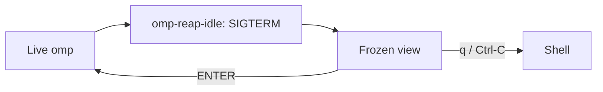

# herdr-omp-sleep

A live `omp` coding-agent session running in a herdr pane holds roughly 400 MB of RSS. Open a dozen panes across a few projects and the machine is out of memory — but closing them loses your place in every conversation. herdr-omp-sleep parks an *idle* session instead: once a pane has been quiet long enough, the omp process is stopped, the pane keeps living as a frozen, scrollable view of the whole conversation, and pressing ENTER brings the session back exactly where it was. Quitting omp yourself still just quits — sleep is something the idle reaper does to you, never something your own Ctrl-C triggers. A sleeping pane measures about 4 MB — 1.8 MB for `less`, 2.2 MB for the wrapper watching it — instead of ~400 MB for a live one; on the development machine, six sleeping panes together used 9.9 MB.

## What you get

- Idle panes sleep after N minutes (default 15), ENTER wakes them back into the same session, and q/Ctrl-C leaves a sleeping pane at its shell.
- The frozen view isn't a screenshot: the whole conversation is rendered from the session's `.jsonl`, and omp's own last frame is appended underneath it verbatim, so colors and tool-call cards are exactly what you were looking at. The reaper bakes that frame with `herdr pane read --format ansi` while omp is still alive.
- The pane stays in herdr's agents sidebar as a dim `omp (sleeping)` row instead of dropping off the list. Live panes keep their normal green state.
- A session nobody ever typed into is retired to its shell rather than parked — see [Sessions with no conversation](#sessions-with-no-conversation).
- An unsent message is never lost — see [Unsent messages](#unsent-messages).

## How it works

The loop:



**`omp-reap-idle`** runs on a 900-second launchd schedule. It asks herdr for every idle, unfocused pane, works out how long each has really been idle from the session's last conversation turn, and — once a pane clears the threshold and passes every guard below — bakes the pane's current frame with `herdr pane read --format ansi` and sends omp a SIGTERM. For a pane that was never started through the wrapper, it also waits for the shell to come back and types `omp-pane --parked` into it, so sleep behaves the same no matter how the pane began. Two smaller jobs ride along on the same tick: retiring sessions that have no conversation in them, and labelling parked panes whose wrapper is too old to label itself.

**`omp-pane`** is what herdr templates should run instead of bare `omp`. It runs omp, and when omp exits because the reaper sent SIGTERM, it resolves which session just ended (the reaper's hint file first, an explicit `--resume=`, or the newest matching session born after the pane started; if none of that resolves to a real file, it exits to the shell instead of guessing), badges the pane `omp (sleeping)` in herdr's sidebar over the same socket omp's own integration uses, and hands off to `omp-frozen`. User Ctrl-C is treated as an explicit close and exits to the shell instead of parking.

**`omp-frozen`** renders the whole conversation from the session's `.jsonl` — user turns, assistant text and tool calls, truncated tool output — into a cached, colored text view, then appends the exact frame the reaper baked while omp was still running, so the bottom of the screen is exactly what you left. It opens the result in `less`, scrolled to the bottom, with ENTER wired to wake and q/Ctrl-C wired to exit to the shell.

**`draft-keeper.ts`** is an omp extension that mirrors the composer's text to `~/.omp/agent/frozen/<pane>.draft` every 5 seconds and once more on shutdown, and restores it into an empty composer on the next session start. Its only other reader is the reaper, which treats a non-empty draft file as a reason not to sleep the pane.

## What it refuses to do

This is the trust section: every line below is a guard that actually exists in `omp-reap-idle`, not an aspiration.

- Only touches a pane herdr reports as `idle` and unfocused — never one that's `working` (a turn is running) or `blocked` (waiting on your answer).
- Idle age comes from the last real conversation turn in the session file, never the file's mtime. Idle compaction, autolearn, and the shutdown record all touch a session without you being there; on a real session, mtime claimed 33 minutes idle while the last actual turn was 1214 minutes old.
- If the session file was written in the last 60 seconds, the pane is left alone — never SIGTERM omp mid-compaction.
- SIGTERM, never SIGKILL: omp flushes a final record on the way out, which is what keeps the session resumable.
- It resolves omp's pid by matching `bin/omp` exactly, anchored so `bin/omp-pane` can't match it; if it can't name the process that way, it skips the pane rather than guessing.

## Unsent messages

This is the subtle part, so it gets its own section.

- `draft-keeper.ts` mirrors the composer into `~/.omp/agent/frozen/<pane>.draft` every 5 seconds, and once more on shutdown.
- `omp-reap-idle` checks that file before doing anything else to the pane; if it's non-empty, it skips the pane and logs why instead of sleeping it.
- It refuses to sleep the pane rather than restoring the composer later, because omp only ever hands an extension the composer as text — a pasted image comes back as an `[Image #1, 1024x768]` marker, never the picture. Text is restorable; an attachment provably isn't, so a pane mid-compose stays awake instead of waking up lossy.
- Plain text drafts are still saved and restored: the next session started in that pane comes back up with the message already in the composer.

## Sessions with no conversation

An `omp` opened in a pane and never typed into has no session file at all — omp writes one on the first turn. There is nothing to freeze and nothing to resume, so parking such a pane would leave it on an empty transcript.

Instead the reaper retires it: SIGTERM, and the pane falls back to its shell, free to be reused or closed. Nothing is lost, because nothing was ever said. The clock is omp's own uptime rather than a conversation turn, and the grace period is `EMPTY_MIN` — four times `IDLE_MIN` by default, since a pane sitting at a fresh prompt is plausibly one you are about to type into. `EMPTY_MIN` is read from the environment; to change it for the scheduled run, add it beside `IDLE_MIN` in the launchd plist.

The draft guard applies here first: a pane with something typed but unsent is left alone even though its session is still empty.

A wrapped pane is handed an *empty* hint file on the way out. That is the wrapper's signal to skip the pager and exit to the shell, and it also stops the wrapper falling through to its last resort — the newest session in that directory, which can belong to a different pane working in the same repo. A bare pane has no wrapper to read that hint, so it isn't written; otherwise it would sit in `frozen/` and confuse the next wrapper started in that pane.

## Requirements

`install.sh` checks the first two before it installs anything:

- macOS — the reaper is a launchd agent, and the scripts use BSD `stat -f` for file times.
- `herdr`, `omp`, `jq`, `less`, and `nc` on `PATH`.

Not version-checked by the installer, but required: herdr 0.8 or newer.

## Install

```bash
git clone https://github.com/xenking/herdr-omp-sleep.git
cd herdr-omp-sleep
./install.sh
```

Options:

- `--prefix DIR` — where the three scripts land. Default `~/.local/bin`.
- `--idle-min N` — minutes of inactivity before a pane sleeps. Default `15`. The reaper also derives `EMPTY_MIN` from it: 4×, the grace given to a session with no conversation.
- `--herdr-templates` — also rewrite existing herdr pane templates from `command = "omp"` to `command = "omp-pane"`, backing up every file it touches and printing the list.
- `--uninstall` — remove the scripts, the extension and the launchd agent (see [Uninstall](#uninstall)).
- `-h`, `--help`

This installs the three scripts (`omp-pane`, `omp-frozen`, `omp-reap-idle`) into `--prefix`; `draft-keeper.ts` into `$PI_CODING_AGENT_DIR/extensions` (default `~/.omp/agent/extensions`); and a launchd agent at `~/Library/LaunchAgents/com.$(id -un).omp-reap-idle.plist`, labelled `com.$(id -un).omp-reap-idle`, that runs the reaper every 900 seconds with `IDLE_MIN` set from `--idle-min` in its environment and stderr logged to `~/.local/state/omp-reap.err`.

Make sure `--prefix` is on `PATH`: herdr templates launch the bare command name `omp-pane`, and the reaper does the same when it parks a pane that started life as bare `omp`. `install.sh` checks this itself and warns if it isn't.

Nothing needs restarting for panes that are already running plain `omp` — the reaper wraps them into the sleep loop itself, the first time they go idle.

```bash
./install.sh --prefix ~/.local/bin --idle-min 20 --herdr-templates
```

## Configuration

The only tunable is idle timeout, and the installer keeps two copies of its default in sync. `--idle-min N` writes `N` into `EnvironmentVariables.IDLE_MIN` inside the launchd plist — what the scheduled reaper reads — and, if `N` isn't the built-in `15`, `install.sh` also rewrites the `IDLE_MIN=${IDLE_MIN:-15}` default line inside the installed `omp-reap-idle` itself, with a one-line `sed`. That second step is why running `omp-reap-idle` by hand, with no environment set, inspects exactly the panes the scheduled job would — the manual default and the plist's value are never allowed to drift apart.

## Verify

See what would happen without touching anything:

```bash
DRY_RUN=1 IDLE_MIN=0 EMPTY_MIN=0 omp-reap-idle
```

`IDLE_MIN=0` makes every idle, unfocused pane a candidate no matter how long it's actually been idle, and `EMPTY_MIN=0` does the same for sessions with no conversation; `DRY_RUN=1` prints one line per pane instead of signaling anything: `would sleep <pane> pid=<pid> idle=<n>m`, `would retire <pane> pid=<pid> up=<n>m (no turns)`, `would badge <pane> (parked, wrapper too old to label itself)`, or, for a pane an unsent draft is holding awake, `skip <pane> unsent draft (<n> bytes), left awake`.

See what a real run — scheduled or manual — actually did:

```bash
tail ~/.local/state/omp-reap.log
```

Each timestamped line is one of: `slept <pane> pid=<pid> idle=<n>m resume=<path>` for a pane it put to sleep, `skip <pane> unsent draft (<n> bytes), left awake` for one a draft protected, or `WARN <pane> omp still alive, left at shell` for a bare pane that didn't drop to its shell after SIGTERM.

Check the schedule itself:

```bash
launchctl print gui/$(id -u)/com.$(id -un).omp-reap-idle | grep -E 'state|runs'
```

## Uninstall

```bash
./install.sh --uninstall
```

Removes the three scripts from `--prefix`, `draft-keeper.ts` from the extensions directory, and the launchd agent. `~/.omp/agent/frozen/` — session hints, baked frames, unsent drafts — is left in place. As the uninstaller itself puts it: "Panes parked right now keep their frozen view until you press ENTER."

## Limits

- macOS only: the reaper is a launchd agent and the scripts shell out to BSD `stat -f`.
- herdr panes only: the pane wrapper and the draft extension both key off `HERDR_PANE_ID`, which only exists inside a herdr pane.
- A pane launched from a herdr template whose `command` is still bare `omp` is not wrapped at birth. It still sleeps — the reaper retrofits the wrapper by parking the pane with `omp-pane --parked` after the kill — but that path needs the pane to fall back to a shell first, and logs `WARN … omp still alive, left at shell` if it doesn't. `--herdr-templates` removes the retrofit by wrapping such panes from the start.
- A wrapper process that started before an upgrade keeps running the old body: bash freezes a script at exec, and this one only re-execs when it parks. A wrapper predating the sidebar badge therefore sleeps its pane without labelling it, and herdr keeps showing the dead session's green `omp`. The reaper labels such panes itself on its next tick, so the wrong colour can persist for up to 15 minutes.
- A wrapper old enough to predate this behaviour also parks on *your* quit, not just the reaper's: quitting omp in such a pane drops you into the frozen view, and one `q` from there gets you the shell. It re-execs itself on its next sleep and behaves from then on.
- A herdr pane id that gets reused by an unrelated new pane can have a stale draft restored into it. It lands visibly in the composer and is deletable, not silently sent anywhere.
- A draft containing an attachment keeps its pane awake indefinitely, until you send or clear it — there's no timeout on that guard.

## License

[MIT](LICENSE).
