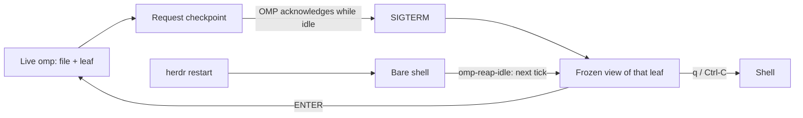

# herdr-omp-sleep

A live `omp` coding-agent session running in a herdr pane holds roughly 400 MB of RSS. Open a dozen panes across a few projects and the machine is out of memory — but closing them loses your place in every conversation. herdr-omp-sleep parks an *idle* session instead: once a pane has been quiet long enough, the omp process is stopped, the pane keeps living as a frozen, scrollable view of the whole conversation, and pressing ENTER brings the session back exactly where it was. Quitting omp yourself still just quits — sleep is something the idle reaper does to you, never something your own Ctrl-C triggers. A sleeping pane measures about 4 MB — 1.8 MB for `less`, 2.2 MB for the wrapper watching it — instead of ~400 MB for a live one; on the development machine, six sleeping panes together used 9.9 MB.

## What you get

- Idle panes sleep after N minutes (default 15), ENTER restores the same session **and tree branch**, and q/Ctrl-C returns to the shell.
- The frozen view is not a screenshot and not a description: the whole conversation is re-rendered by **omp's own transcript components**, in **your** theme and settings — the same `initTheme(symbolPreset, colorBlindMode, theme.dark, theme.light)` call `omp gallery` makes, so real colours, message bubbles, tool-call cards and usage footers. It ends where the conversation ends, which is the screen you left.
- Tool output starts **folded**, exactly as omp shows it, and `o` unfolds every result in full while `O` folds back — `less` holds both renders, so switching keeps your place in each. Both open at the end of the conversation.
- Rendered at the pane's **real** width, re-derived on every open, with `r` to re-render after a resize. Measured: a 35 MB session → 31,656 folded rows / 1,305 tool-call cards in 2.5 s per view.
- `omp-hist`, or `/full-hist` inside omp, opens that same render for a **live** session at any time, with the same keys, in a split pane. Compaction shrinks what the model sees and takes the TUI's scrollback with it; the `.jsonl` on disk keeps everything, and this is how you read it.
- The pane stays in herdr's agents sidebar as a dim `omp (sleeping)` row instead of dropping off the list, and comes back as a live row on wake. Both directions are reported explicitly, because every other painter of that row is edge-triggered: omp's own integration reports on state *change*, and herdr's process detection only re-reads a pane whose foreground process group changed — which a wrapped pane's never does.
- A herdr restart no longer strands parked panes: the reaper puts them back into their frozen view on its next tick — 27 panes on this machine after the server died.
- A session nobody ever typed into is retired to its shell rather than parked — see [Sessions with no conversation](#sessions-with-no-conversation).
- An unsent message is never lost — see [Unsent messages](#unsent-messages).

## How it works

The loop:



**`omp-reap-idle`** runs every 900 seconds and on the installed Herdr startup hook. For an idle, unfocused pane it resolves the actual OMP PID and reads that process's fresh pane snapshot. It requests a checkpoint and waits up to ten seconds for the running extension to acknowledge the exact file, session ID and tree leaf before sending SIGTERM. No acknowledgement means the pane stays awake. Other passes retire confirmed empty sessions, repair badges, revive parked panes, and prune state only when server identity and pane ownership permit it.

**`omp-pane`** consumes the completed per-pane checkpoint, not its startup `--resume` argument or the last entry in the journal. It passes the saved leaf to `omp-frozen`. On ENTER it resumes that file and invokes the local `/omp-sleep-resume` extension command, which uses OMP's native tree navigation before any model turn. The command checks both session ID and leaf. A missing/invalid checkpoint returns to the shell rather than selecting another branch. Ordinary user exit still returns to the shell.

**`omp-frozen`** builds folded and unfolded views at the pane's real width. ENTER wakes; q/Ctrl-C returns to the shell; o/O changes folding; r rebuilds for a resized pane. Cache identity includes the session, **leaf**, width and folding mode. Journal writes, renderer changes and OMP upgrades invalidate cached views, but another branch's later entries cannot change the selected ancestry. A legacy one-argument invocation is accepted only when the renderer can identify an unambiguous tree.

The legend along the bottom is sized to the pane. less truncates its prompt at the screen width, so the full version — 120 characters with the line counters filled in — lost everything from `r rewidth` onward on an 84-column split, `q close` included. Panes narrower than 100 columns get a terse form that leads with the keys that end the pane: `SLEEPING 2383/2452 · ENTER wake · q close · o/O · r`.

**`omp-render`** is the renderer, and it is omp itself: `ChatTranscriptBuilder.rebuild(entries)` is the same call the live TUI makes to turn session records into components, and every component implements `render(width): readonly string[]` (`pi-tui/src/tui.ts:150`), so `container.render(cols)` returns omp's real rows. It initialises settings and the theme exactly the way `omp gallery` does (`cli/gallery-cli.ts:233`) — passing `symbolPreset`, `colorBlindMode`, `theme.dark` and `theme.light`, because a bare `initTheme()` silently falls back to the generic `dark` theme; the same file's `resolveWidth` is where the width clamp comes from. Folded is the default, `--unfold` expands every tool result, and the only stubs are the no-op repaint hooks the component tree would call on a live TUI. `--md` switches to omp's plain `/dump` formatter, useful for grepping a conversation but visually nothing like it. omp exposes no CLI route to any of this: `--export` is HTML-only and `omp read history://` is the deliberately abridged formatter that collapses every tool result to a single line.

`omp-render --leaf=<entry-id> [--md] [--unfold] <session.jsonl> [width]` walks only the requested ancestry. Missing leaves, broken parents and cycles fail explicitly. Without `--leaf`, a branched journal is rejected instead of choosing whichever pane wrote last.

**`omp-hist`** opens full history on demand: `omp-hist` for this pane, `omp-hist <pane-id>` for another, or `omp-hist <session.jsonl> <leaf-id>` explicitly. Pane lookup uses the live PID snapshot or completed parked cursor; it does not infer a branch from a file-only Herdr report. The leaf is preserved when opening a split. On a tty it pages in place.

**`draft-keeper.ts`** is an omp extension that mirrors the composer's text to `~/.omp/agent/frozen/<pane>.draft` every 5 seconds and once more on shutdown, and restores it into an empty composer on the next session start. Its only other reader is the reaper, which treats a non-empty draft file as a reason not to sleep the pane.

**`full-hist.ts`** supplies its live session file and selected leaf directly to `omp-hist`, so `/full-hist` keeps the current branch even when another pane shares the journal.

**`sleep-state.ts`** runs only in root TUI contexts. It publishes `frozen/<pane>.live.<pid>.json` every five seconds and after session/tree changes. A pending sleep request causes it to append an invisible `omp-sleep-anchor` on the active branch and acknowledge `frozen/<pane>.cursor.json`. This non-message anchor avoids native tree navigation treating a user-message leaf as a request to re-edit that message. The plain `<pane>.session` file remains the park-vs-exit signal for old wrappers.

The same extension reports the lifetime of the actual Ask dialog through Herdr's `herdr:blocked` event. This includes asks reached through `eval` and helper calls, which need not emit the outer tool-execution events. Answer, cancellation and rejection clear the block in `finally`; no generated Herdr integration file is patched.

## What it refuses to do

This is the trust section: every line below is a guard that actually exists in `omp-reap-idle`, not an aspiration.

- Never touches a pane that is running a turn or waiting on your answer. herdr's agent row says which, but the row is not trusted on its own: it can freeze (see [Limits](#limits)), so a pane is also skipped whenever its terminal title carries omp's braille spinner — the marker the pane itself writes while a turn runs, and drops for `>` when it's your move.
- Session identity comes only from a fresh snapshot matching the actual OMP PID. A startup `--resume`, a file-only Herdr report, or the newest file in a directory cannot identify the active branch.
- A missing file is eligible for empty-session retirement only when the owning extension explicitly reports no conversation messages. Otherwise it remains unknown.
- The pane you are looking at is never slept, full stop. This was a soft rule once — a focused pane got the longer `EMPTY_MIN` grace rather than an exemption, on the grounds that herdr's per-pane `focused` flag survives you moving to another window — and the result was a session going to sleep at 75 idle minutes while its tab was open in front of a human reading it. The signal is now the server's own `focused_pane_id`, which exactly one pane holds at a time and which moves as you switch panes, so honouring it costs at most one live omp. The reaper logs `skip <pane> focused` every tick it declines for this reason.
- Idle age comes from the last real conversation turn in the session file, never the file's mtime. Idle compaction, autolearn, and the shutdown record all touch a session without you being there; on a real session, mtime claimed 33 minutes idle while the last actual turn was 1214 minutes old.
- Idle age is also floored by omp's own uptime, so waking a pane always buys a full `IDLE_MIN` of reading time. Without that floor, resuming a session whose last turn was last night reads as `idle=1107m` and the next tick puts it straight back to sleep while you page through it — reading writes no turn, so the conversation clock cannot see you.
- If the session file was written in the last 60 seconds, the pane is left alone — never SIGTERM omp mid-compaction.
- SIGTERM, never SIGKILL: omp flushes a final record on the way out, which is what keeps the session resumable.
- It resolves omp's pid by matching `bin/omp` exactly, anchored so `bin/omp-pane` can't match it; if it can't name the process that way, it skips the pane rather than guessing.

## Unsent messages

This is the subtle part, so it gets its own section.

- `draft-keeper.ts` mirrors the composer into `~/.omp/agent/frozen/<pane>.draft` every 5 seconds, and once more on shutdown.
- `omp-reap-idle` checks that file before doing anything else to the pane; if it's non-empty, it skips the pane and logs why instead of sleeping it.
- It refuses to sleep the pane rather than restoring the composer later, because omp only ever hands an extension the composer as text — a pasted image comes back as an `[Image #1, 1024x768]` marker, never the picture. Text is restorable; an attachment provably isn't, so a pane mid-compose stays awake instead of waking up lossy.
- Plain text drafts are still saved and restored: the next session started in that pane comes back up with the message already in the composer.

## Sessions with no conversation

An `omp` opened in a pane and never typed into has no session file at all — omp writes one on the first turn. There is nothing to freeze and nothing to resume, so parking such a pane would leave it on an empty transcript.

Instead the reaper retires it: SIGTERM, and the pane falls back to its shell, free to be reused or closed. Nothing is lost, because nothing was ever said. The clock is omp's own uptime rather than a conversation turn, and the grace period is `EMPTY_MIN` — four times `IDLE_MIN` by default, since a pane sitting at a fresh prompt is plausibly one you are about to type into. `EMPTY_MIN` is read from the environment; to change it for the scheduled run, add it beside `IDLE_MIN` in the launchd plist.

The draft guard applies here first: a pane with something typed but unsent is left alone even though its session is still empty.

A wrapped empty pane receives an empty `.session` signal and returns to its shell without entering the pager. Its cursor and dead live snapshot are cleared. Unknown ownership is never treated as an empty conversation.

## Requirements

`install.sh` checks the first two before it installs anything:

- macOS — the reaper is a launchd agent, and the scripts use BSD `stat -f` for file times.
- `herdr`, `omp`, `bun`, `jq`, `less`, and `nc` on `PATH`. `bun` renders the transcript through omp's own formatter; it ships with omp itself.

- OMP with the public `session_tree`, `getLeafId`, `navigateTree`, `askDialog` and managed timer extension APIs (verified with 18.1.11).
Not version-checked by the installer, but required: herdr 0.8 or newer.

## Install

```bash
git clone https://github.com/xenking/herdr-omp-sleep.git
cd herdr-omp-sleep
./install.sh
```

Options:

- `--prefix DIR` — where the five scripts land. Default `~/.local/bin`.
- `--idle-min N` — minutes of inactivity before a pane sleeps. Default `15`. The reaper also derives `EMPTY_MIN` from it: 4×, the grace given to a session with no conversation.
- `--herdr-templates` — also rewrite existing herdr pane templates from `command = "omp"` to `command = "omp-pane"`, backing up every file it touches and printing the list.
- `--uninstall` — remove the scripts, the extension and the launchd agent (see [Uninstall](#uninstall)).
- `-h`, `--help`

This installs the five scripts (`omp-pane`, `omp-frozen`, `omp-render`, `omp-hist`, `omp-reap-idle`) into `--prefix`; two extensions (`draft-keeper.ts`, `full-hist.ts`) into `$PI_CODING_AGENT_DIR/extensions` (default `~/.omp/agent/extensions`); and a launchd agent at `~/Library/LaunchAgents/com.$(id -un).omp-reap-idle.plist`, labelled `com.$(id -un).omp-reap-idle`, that runs the reaper every 900 seconds with `IDLE_MIN` set from `--idle-min` in its environment and stderr logged to `~/.local/state/omp-reap.err`.

Make sure `--prefix` is on `PATH`: herdr templates launch the bare command name `omp-pane`, and the reaper does the same when it parks a pane that started life as bare `omp`. `install.sh` checks this itself and warns if it isn't.

Nothing needs restarting for panes that are already running plain `omp` — the reaper wraps them into the sleep loop itself, the first time they go idle.

```bash
./install.sh --prefix ~/.local/bin --idle-min 20 --herdr-templates
```

## Configuration

The only tunable is idle timeout, and the installer keeps two copies of its default in sync. `--idle-min N` writes `N` into `EnvironmentVariables.IDLE_MIN` inside the launchd plist — what the scheduled reaper reads — and, if `N` isn't the built-in `15`, `install.sh` also rewrites the `IDLE_MIN=${IDLE_MIN:-15}` default line inside the installed `omp-reap-idle` itself, with a one-line `sed`. That second step is why running `omp-reap-idle` by hand, with no environment set, inspects exactly the panes the scheduled job would — the manual default and the plist's value are never allowed to drift apart.

## Verify

See what would happen without touching anything:

```bash
DRY_RUN=1 IDLE_MIN=0 EMPTY_MIN=0 omp-reap-idle
```

`IDLE_MIN=0` makes every idle, unfocused pane a candidate no matter how long it's actually been idle, and `EMPTY_MIN=0` does the same for sessions with no conversation; `DRY_RUN=1` prints one line per pane instead of signaling anything: `would sleep <pane> pid=<pid> idle=<n>m`, `would retire <pane> pid=<pid> up=<n>m (no turns)`, `would badge <pane> (parked, wrapper too old to label itself)`, `would claim <pane> (live omp, no row)`, or, for a pane held awake, `skip <pane> focused` and `skip <pane> unsent draft (<n> bytes), left awake`.

A bare run sweeps every pane, which is what the schedule wants and the wrong thing for an experiment — verifying one throwaway fixture at `IDLE_MIN=0` also put a real work pane to sleep. Scope it:

```bash
omp-reap-idle --pane wD:p3
```

See what a real run — scheduled or manual — actually did:

```bash
tail ~/.local/state/omp-reap.log
```

Each timestamped line is one of: `slept <pane> pid=<pid> idle=<n>m resume=<path>` for a pane it put to sleep, `skip <pane> unsent draft (<n> bytes), left awake` for one a draft protected, or `WARN <pane> omp still alive, left at shell` for a bare pane that didn't drop to its shell after SIGTERM.

Check the schedule itself:

```bash
launchctl print gui/$(id -u)/com.$(id -un).omp-reap-idle | grep -E 'state|runs'
```

## Uninstall

```bash
./install.sh --uninstall
```

Removes the five scripts from `--prefix`, both extensions from the extensions directory, and the launchd agent. `~/.omp/agent/frozen/` — session hints, parked markers, rendered views, unsent drafts — is left in place. As the uninstaller itself puts it: "Panes parked right now keep their frozen view until you press ENTER."

## Limits

- macOS only: the reaper is a launchd agent and the scripts shell out to BSD `stat -f`.
- herdr panes only: the pane wrapper and the draft extension both key off `HERDR_PANE_ID`, which only exists inside a herdr pane.
- A pane launched from a herdr template whose `command` is still bare `omp` is not wrapped at birth. It still sleeps — the reaper retrofits the wrapper by parking the pane with `omp-pane --parked` after the kill — but that path needs the pane to fall back to a shell first, and logs `WARN … omp still alive, left at shell` if it doesn't. `--herdr-templates` removes the retrofit by wrapping such panes from the start.
- Already-running OMP processes cannot acquire a newly installed extension automatically. Until a pane has a fresh `sleep-state.ts` snapshot, the reaper leaves it awake. Do not restart a shared-file branch blindly merely to upgrade it: first preserve/choose the intended branch in OMP.
- Old parked panes without a saved cursor cannot have their former branch reconstructed reliably. They are not automatically revived to a guessed tip. Select the desired branch manually; future sleeps will capture it once the extension is loaded.
- A herdr pane id that gets reused by an unrelated new pane can have a stale draft restored into it. The reaper drops drafts for pane ids herdr no longer lists, so this needs the id to come back within one 900-second tick. It lands visibly in the composer and is deletable, not silently sent anywhere.
- A draft containing an attachment keeps its pane awake indefinitely, until you send or clear it — there's no timeout on that guard.
- herdr's agent row for a pane can stop tracking that pane. Every omp started inside it reports through the same integration, so a nested session takes the row over, and when that one exits the row keeps its last state: a pane sat on a grey `done` for hours, its `state_change_seq` frozen, while the real omp ran turns underneath. Nothing outside can repair it — herdr accepts `pane.clear_agent_authority` and `pane.report_agent_session` from an official source with `ok` and applies neither. The next omp *start* in that pane fixes it, which sleeping and waking the pane does for you. The guards above are written so that a lying row costs you a delayed sleep, never a killed session.
- OMP may still append diagnostic exit records or repair interrupted tool calls. The saved non-message checkpoint determines resume position, not the physical last record; the original shared journal is never rewritten or split by this package.
- Reading a pane is still not a signal the reaper can see; focus is the proxy for it. The pane holding `focused_pane_id` is exempt outright, and the uptime floor buys a woken pane a full `IDLE_MIN` — but a pane you are reading in a *different* window, or in a tab you switched away from, has neither, and sleeps under you after `IDLE_MIN` without a turn. Screen contents are no help: an idle omp still repaints its burn-rate cell every second, so nothing in the grid distinguishes reading from being away.
- After a Herdr restart, parked panes are revived from their completed per-pane cursors. Two panes sharing one journal remain distinct because their leaves differ; no session-file deduplication is performed. Cursorless legacy markers are left alone rather than reconstructed from the sleep log.
- Sleep is a marker on disk, not a state herdr knows about. A marker whose pane no longer exists is litter, so the reaper prunes markers for pane ids herdr no longer lists — but a marker belonging to a pane that outlives its session directory is not distinguishable from a live one.
- Two renders per width means two files and two passes: 31,656 folded + 52,797 unfolded rows, ~5 s and 26 MB of cache for one 35 MB conversation, 223 MB across this machine's 35 parked sessions. That buys a fold toggle that keeps your place in both views, which one file cannot. The reaper drops any view untouched for a week; they rebuild in seconds.
- A resize does not re-wrap a parked pane on its own. omp's components pre-wrap every row, and `less` cannot undo that, so the view stays at the width it was rendered at until you press `r` (or wake and sleep the pane again). The next open always re-derives the width.
- An upgrade to omp can move `ChatTranscriptBuilder`, `Settings.init` or `initTheme` — the three internal entry points `omp-render` imports. It fails loudly if they go, and the frozen view then shows a page naming the session file instead of a transcript. There is deliberately no degraded renderer behind it.

## License

[MIT](LICENSE).
